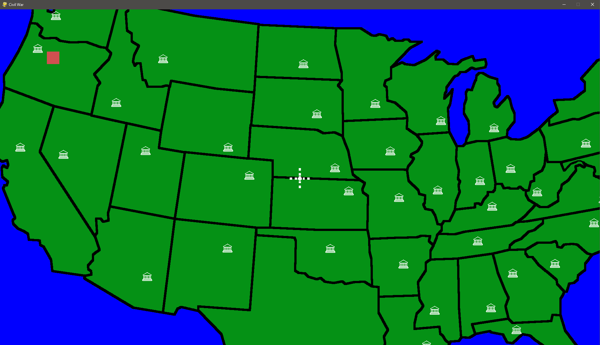
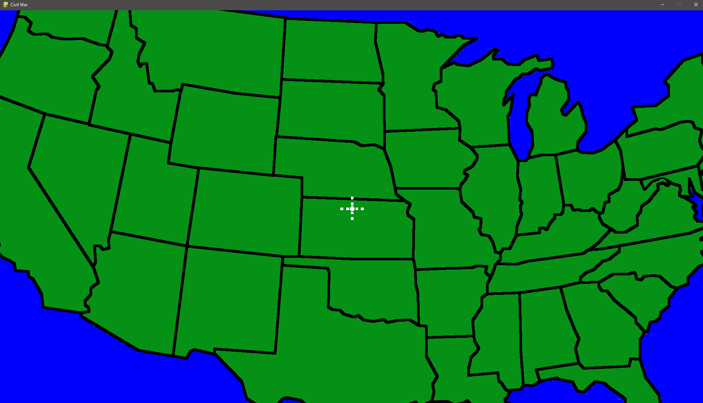

<h1>State Civil War Game</h1>

Hello, making this game as a waste of time whenever I am bored and want to kill a few hours, burn some calories, and stress unitll I rage quit. Seen so many mobile ads for games like this when trying to watch infographics show or documentaries, I thought "why not, can at least re familiarize myself with python and might be fun 🙃"

<h3>---> 11/18/22 Most Current Render of Game - alpha v.00000002</h3>

<figcaption>Added armies and state classes with capitals for all continental states </figcaption>

<h4>---> 11/14/22 - alpha v.00000001</h3>

<figcaption>Not much just a baisc map and moveable crosshair camera :)</figcaption>
